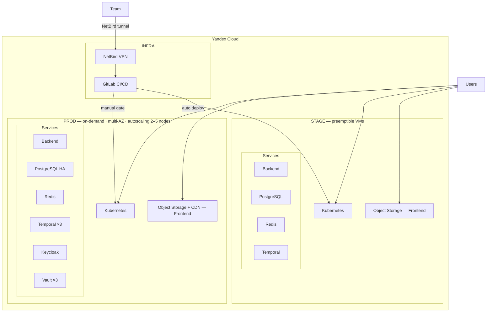

# Yandex Cloud — Production Infrastructure Example

Portfolio-grade example of a production infrastructure on Yandex Cloud. Based on a real project with a full CI/CD pipeline, Kubernetes deployments, and GitOps workflows.

## Stack

**Application**
- Backend: Python 3.12 · FastAPI · SQLAlchemy · Alembic · Temporal
- Frontend: React 18 · TypeScript · Vite

**Infrastructure**
- Cloud: Yandex Cloud (VMs, Managed Kubernetes, Object Storage, CDN, Container Registry, KMS)
- IaC: OpenTofu (Terraform-compatible)
- Configuration management: Ansible
- CI/CD: GitLab CI with Helm deployments to Kubernetes
- Auth: Keycloak (SSO)
- Secrets: HashiCorp Vault (3-node Raft cluster, auto-unseal via YC KMS)
- DB: PostgreSQL via CloudNativePG operator (HA in prod)
- Cache: Redis
- Monitoring: Prometheus + Grafana + Loki
- Ingress: nginx-ingress + cert-manager (Let's Encrypt)

## Repository structure

```
├── app/
│   ├── backend/       # FastAPI service (stub)
│   └── frontend/      # React SPA (stub)
└── infra/
    ├── terraform/
    │   ├── environments/
    │   │   ├── infra/  # VPN (NetBird) + GitLab
    │   │   ├── stage/  # Kubernetes cluster, preemptible VMs
    │   │   └── prod/   # Kubernetes cluster, on-demand, multi-AZ
    │   └── modules/    # Reusable modules: k8s, postgresql, redis, temporal, ...
    ├── ansible/
    │   ├── roles/      # VPN, GitLab, Keycloak, Vault, monitoring, ...
    │   └── playbooks/
    └── gitlab-ci/
        ├── templates/  # Reusable CI/CD pipeline templates (backend, frontend)
        ├── helm/app/   # Helm chart + values per environment
        └── scripts/    # deploy.sh, secret sync
```

## Environments

| Environment | Purpose                              | VMs         |
|-------------|--------------------------------------|-------------|
| **INFRA**   | NetBird VPN + GitLab + Runners       | on-demand   |
| **STAGE**   | Full copy of prod, cheaper           | preemptible |
| **PROD**    | Production, HA, auto-scaling 2–5 nodes | on-demand |

## Architecture



## Key design decisions

- **No public access to databases or internal services** — all access goes through NetBird VPN
- **Secrets in HashiCorp Vault** — nothing in env files or code; secrets synced to K8s via Vaultwarden + bw CLI at deploy time
- **Infrastructure as Code** — every change is a git commit; full environment can be reproduced from scratch
- **GitLab CI with manual prod gate** — stage deploys automatically, prod requires manual approval
- **Preemptible VMs on stage** — 3× cheaper; acceptable for non-production workloads
- **PostgreSQL HA via CloudNativePG** — automated failover with streaming replication

## Getting started

### Prerequisites

- Yandex Cloud account with a configured folder
- OpenTofu ≥ 1.6
- Ansible ≥ 2.15
- kubectl + helm

### 1. Set required variables

Copy and fill the variables files:

```bash
# Terraform
cp infra/terraform/environments/prod/terraform.tfvars.example \
   infra/terraform/environments/prod/terraform.tfvars
# Fill in YOUR_YC_CLOUD_ID, YOUR_YC_FOLDER_ID, SSH key, etc.
```

```bash
# Ansible
cp infra/ansible/inventories/hosts.yml.example \
   infra/ansible/inventories/hosts.yml
cp infra/ansible/group_vars/all.yml.example \
   infra/ansible/group_vars/all.yml
```

### 2. Deploy infrastructure

See [infra/DEPLOYMENT_ORDER.md](infra/DEPLOYMENT_ORDER.md) for the full step-by-step order.

### 3. Run the application locally

```bash
cd app/backend
cp .env.sample .env
uv run uvicorn src.main:app --reload
```

```bash
cd app/frontend
cp .env.development .env.local
pnpm install && pnpm dev
```
