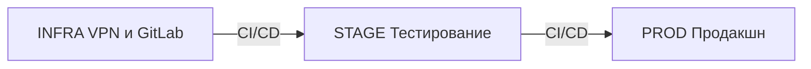
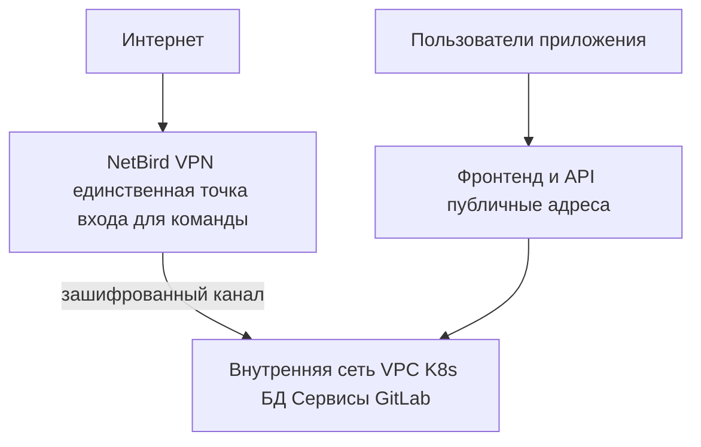
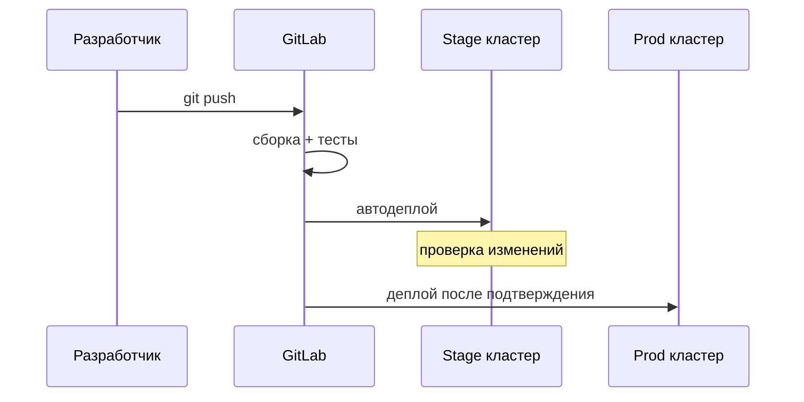
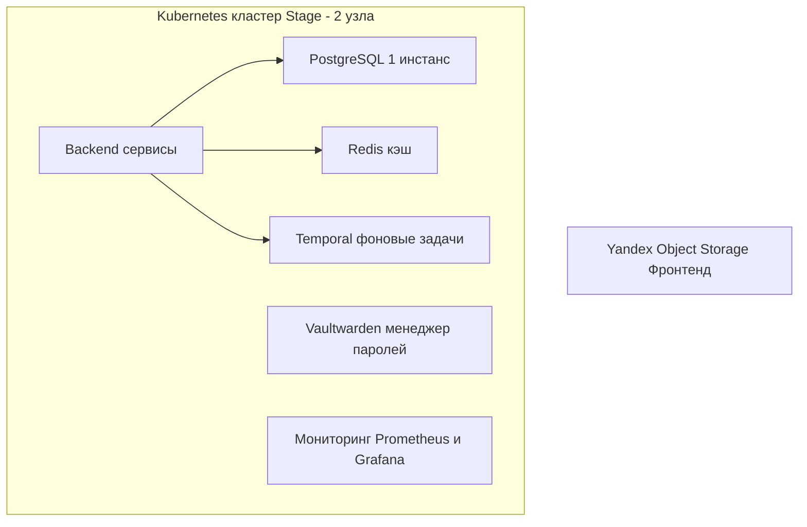
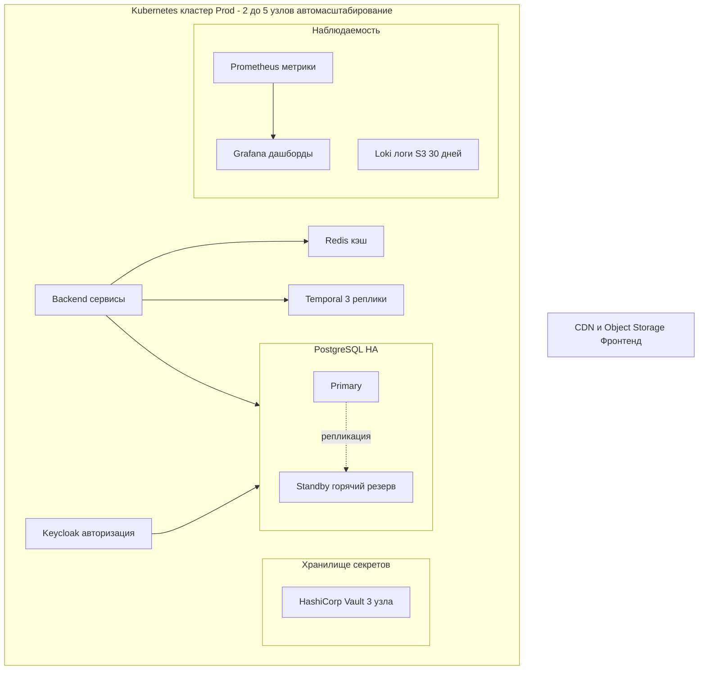
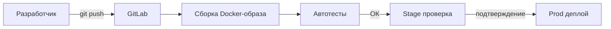
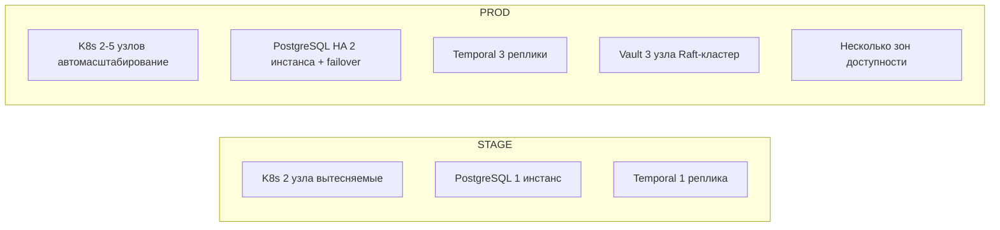
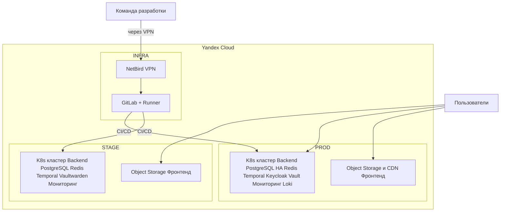

# Описание инфраструктуры проекта

---

## 1. Общая идея

Вся инфраструктура проекта размещена в облаке Yandex Cloud. Это означает, что физических серверов нет — все ресурсы арендуются у провайдера и оплачиваются по факту использования.

Инфраструктура состоит из трёх независимых окружений:

| Окружение | Назначение                                                                                                   |
| ------------------ | ---------------------------------------------------------------------------------------------------------------------- |
| **INFRA**    | Базовые сервисы для всей команды: VPN и система доставки кода (GitLab) |
| **STAGE**    | Тестовая площадка — точная копия боевой среды, но дешевле              |
| **PROD**     | Боевая среда, с которой работают конечные пользователи                  |

---

## 2. Доступ и безопасность

Ни базы данных, ни внутренние сервисы не имеют публичного доступа из интернета. Разработчики и DevOps подключаются через VPN — зашифрованный туннель.

Пользователи приложения подключаются напрямую к публичным адресам фронтенда и API — для них VPN не нужен.

---

## 3. Среда разработки и доставки кода (INFRA)

GitLab — платформа для хранения исходного кода и автоматической доставки изменений на серверы. Разработчик делает правку → GitLab автоматически проверяет, собирает и разворачивает изменение на нужном окружении.

Для каждого окружения (stage, prod) есть отдельный «агент» — GitLab Runner, который выполняет эти автоматические задачи.

---

## 4. Тестовая среда (STAGE)

Безопасная площадка для проверки изменений до выхода в продакшн. Использует более дешёвые «вытесняемые» виртуальные машины — Yandex Cloud может перезапустить их в любой момент, что приемлемо для тестов.

---

## 5. Боевая среда (PROD)

Настроена на высокую доступность. При сбое одного узла система продолжает работать. Использует несколько зон доступности Yandex Cloud — физически разные дата-центры в Москве.

---

## 6. Компоненты простыми словами

### Платформа

**Kubernetes** — управляет запуском всех сервисов. Следит, чтобы они работали, перезапускает при сбоях, распределяет нагрузку. Аналогия: операционная система для облачных приложений.

### Хранение данных

**PostgreSQL (CloudNativePG)** — основная база данных. Хранит все структурированные данные проекта. В prod — два экземпляра: один основной, второй — горячий резерв на случай сбоя.

**Redis** — быстрое хранилище данных в памяти. Используется как кэш: часто запрашиваемые данные не нужно каждый раз читать из базы — они берутся из Redis мгновенно.

### Бизнес-процессы

**Temporal** — система оркестрации фоновых задач. Если процесс прерывается (сбой, перезапуск) — он продолжается с того места, где остановился. Гарантирует выполнение длительных операций.

### Безопасность и доступ

**Keycloak** — централизованная авторизация. Управляет учётными записями, входом пользователей и правами доступа. Один аккаунт для всех сервисов проекта (Single Sign-On).

**HashiCorp Vault** — защищённое хранилище для секретов: паролей, API-ключей, сертификатов. Никакие секреты не хранятся в коде. В prod: кластер из 3 узлов с автоматической разблокировкой через шифрование Yandex Cloud KMS.

**Vaultwarden** — менеджер паролей для команды (self-hosted Bitwarden). Только для внутреннего использования.

### Мониторинг и логи

**Prometheus + Grafana** — система мониторинга. Собирает метрики со всех компонентов и отображает их в виде дашбордов. При проблемах — автоматические алерты.

**Loki** — централизованный сбор логов. Все записи о работе сервисов хранятся в Yandex Object Storage 30 дней — для расследования инцидентов.

**node_exporter** — агент на виртуальных машинах. Собирает метрики CPU, RAM, диска, сети и передаёт их в Prometheus.

### Прочее

**Mailcow** — почтовый сервер проекта для отправки системных уведомлений.

---

## 7. Как код попадает на серверы

Вся инфраструктура описана как код (Infrastructure as Code) с помощью OpenTofu и Ansible. Это означает:

- Любое изменение в инфраструктуре — это изменение в файле, которое можно проверить, обсудить и откатить.
- Вся инфраструктура воспроизводима: при необходимости можно поднять полную копию с нуля.

---

## 8. Безопасность

- Все базы данных и внутренние сервисы **недоступны из интернета**.
- Подключение к инфраструктуре — **только через VPN**.
- Секреты (пароли, ключи) хранятся в **HashiCorp Vault**, а не в коде.
- HTTPS-сертификаты выпускаются **автоматически** через Let's Encrypt.
- Права доступа разграничены по ролям (Keycloak + Vault).
- Логи хранятся **30 дней**, метрики — постоянно.

---

## 9. Надёжность и отказоустойчивость

| Компонент              | Stage                     | Prod                                                      |
| ------------------------------- | ------------------------- | --------------------------------------------------------- |
| K8s узлы                    | 2, вытесняемые | 2–5, on-demand, автомасштабирование   |
| PostgreSQL                      | 1 инстанс          | 2 инстанса, автоматический failover |
| Temporal                        | 1 реплика          | 3 реплики                                          |
| HashiCorp Vault                 | 1 реплика          | 3 узла, Raft-кластер                           |
| Зоны доступности | 1                         | 2 (физически разные ДЦ)                  |
| Вытесняемые VM       | Да (дешевле)     | Нет                                                    |

---

## 10. Стоимость и оптимизация

- **Stage** использует «вытесняемые» виртуальные машины — до 3× дешевле обычных.
- **Prod** — on-demand инстансы с автомасштабированием: в периоды низкой нагрузки кластер сжимается до 2 узлов.
- **Логи** хранятся в объектном хранилище — один из самых дешёвых способов хранить большие объёмы данных.
- **Фронтенд** раздаётся из объектного хранилища — не требует выделенных серверов для статики.

---

## Приложение: общая схема

---

*Версия 1.0 · май 2026*
